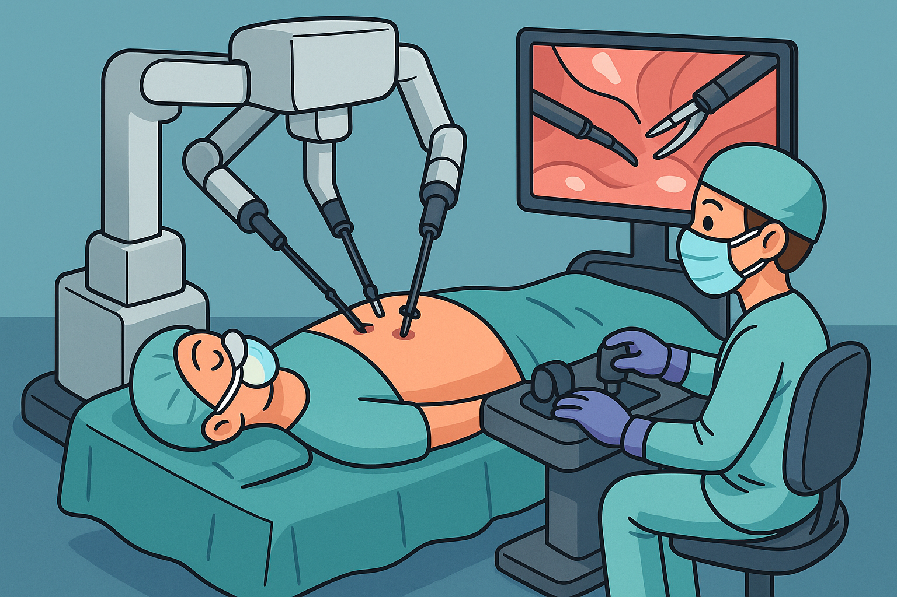

<!-- # SurgVISTA
## Large-scale Self-supervised Video Foundation Model
for Intelligent Surgery -->

[](https://arxiv.org/abs/2506.02692)

[](https://huggingface.co/syangcw/SurgVISTA)
--- 

## 🔧 Status

- [x] Paper submitted: [Arxiv](https://arxiv.org/pdf/2506.02692)
- [x] Full code released
---

## 🔬 Abstract


Computer-Assisted Intervention (CAI) has the potential to revolutionize modern surgery, with surgical scene understanding serving as a critical component in supporting decision-making, improving procedural efficacy, and ensuring intraoperative safety.
While existing AI-driven approaches alleviate annotation burdens via self-supervised spatial representation learning, their lack of explicit temporal modeling during pre-training fundamentally restricts the capture of dynamic surgical contexts, resulting in incomplete spatiotemporal understanding. In this work, we introduce the first video-level surgical pre-training framework
that enables joint spatiotemporal representation learning from large-scale surgical video data. To achieve this, we constructed a large-scale surgical video dataset comprising 3,650 videos and approximately 3.55 million frames, spanning more than 20 surgical procedures and over 10 anatomical structures. Building upon this dataset, we propose **SurgVISTA** (**Surg**ical
**Vi**deo-level **S**patial-**T**emporal **A**rchitecture), a reconstruction-based pre-training method that captures intricate spatial structures
and temporal dynamics through joint spatiotemporal modeling. Additionally, SurgVISTA incorporates image-level knowledge distillation guided by a surgery-specific expert to enhance the learning of fine-grained anatomical and semantic features. To
validate its effectiveness, we established a comprehensive benchmark comprising 13 video-level datasets spanning six surgical procedures across four tasks. Extensive experiments demonstrate that SurgVISTA consistently outperforms both natural- and surgical-domain pre-trained models, demonstrating strong potential to advance intelligent surgical systems in clinically meaningful scenarios.

## ⚙️ Installation
Instructions for setting up the environment...
### OS Requirements
This repo has been tested on the following system and GPU:
- Ubuntu 22.04.3 LTS
- NVIDIA H800 PCIe 80GB


First clone the repo and cd into the directory:

```bash
git clone https://github.com/isyangshu/SurgVISTA
cd SurgVISTA
```

To get started, create a conda environment containing the required dependencies:

```bash
conda env create -f SurgVISTA.yml
```
Activate the environment:
```bash
conda activate SurgVISTA
```

## 📂 Data
Download and preprocess the dataset...

### 🌐 Public Data

**Publicly available datasets used in this project.**

- 🎞️ **Frame Extraction**: Refer to the `/datasets/data_processing/extractframes/extract_frames.py` for scripts to extract frames from videos.
- 📐 **Frame Resizing**: See the `/datasets/data_processing/extractframes/resize_frame.py` for resizing extracted frames to the desired resolution.
- 🔢 **Frame Counting**: Use the codes in `/datasets/data_processing/extractframes/count_frame.py` to count the number of frames per dataset.
- 📂 **Data Preprocessing**: See `datasets/data_processing/pretrain_preprosses` scripts that preprocess each dataset and generate .pkl files for pre-training.
- 📂 **Dataset Construction**: See `datasets/datasets4pretraining` for dataset building logic.

### 📺 Online Video Collection

For videos collected from online sources, you can directly follow the [GenSurgery](https://github.com/SamuelSchmidgall/GSViT) pipeline for downloading.

After manually removing invalid or corrupted videos, the cleaned dataset can be used directly for pre-training.

We further curated the dataset by:
- Adding additional relevant surgical videos manually
- Filtering out unrelated or low-quality content

The complete video dataset will be released via [Hugging Face Datasets](https://huggingface.co/datasets/syangcw/SurgVISTADATA) after final cleaning and validation.

### 📚 Related Resources

You may also refer to the following projects for dataset construction strategies:

- [SurgeNet](https://github.com/TimJaspers0801/SurgeNet): Built upon [GenSurgery](https://github.com/SamuelSchmidgall/GSViT), this project provides a similar pipeline for collecting and preprocessing surgical video data.
- [Surg3M](https://github.com/visurg-ai/surg-3m): A large-scale surgical video dataset with detailed documentation and public access.

## 🧠 Pre-training
Run the pre-training pipeline on your own data...

### 🧪 Teacher Checkpoint

Please refer to [this link](https://github.com/RoyHirsch/endossl) for the teacher model checkpoint used in our pre-training pipeline. We also release our own converted PyTorch `.pth` checkpoint, available at [this link](https://drive.google.com/file/d/1bazW3W5Cglzfeeh_pdJALLktfxpateJ6/view?usp=sharing). To use it, specify the path via `--image_teacher_model_ckpt_path checkpoints/teacher.pth`.

### 🧪 Training script

```bash
sh pretrain_SurgVISTA/pretrain.sh
```
The following hyperparameters are used in our training pipeline. You can adjust them via command-line arguments or config files.

| Hyperparameter     | Default Value | Description                                                                 |
|--------------------|---------------|-----------------------------------------------------------------------------|
| `OUTPUT_DIR`    | `-`        | Path to save training logs and checkpoints.                                   |
| `DATA_ROOT`    | `-`        | Root path where preprocessed datasets are stored.                                   |
| `learning_rate`    | `1.5e-4`        | Initial learning rate for the optimizer.                                   |
| `image_teacher_loss_weight`     | `0.05`        | Weight to balance the loss between the image teacher task and the main pre-training objective.              |
| `video_reconstruction_loss_weight`     | `1.0`        | Weight to balance the loss between the image teacher task and the main pre-training objective.              |
| `optimizer`        | `AdamW`       | Optimizer used for training.                                               |               |
| `warmup_epochs`     | `40`         | Number of epochs to linearly warm up the learning rate.                     |
| `batch_size`       | `64`          | Number of samples per training batch.                                      |
| `num_epochs`       | `201`         | Total number of training epochs.  (+1 for successfully saving 200.pth)                                         |
| `decoder_depth_image`      | `2`            | Number of transformer decoder layers used for the image branch.            |
| `decoder_depth_video`      | `4`            | Number of transformer decoder layers used for the video branch.            |
| `feat_decoder_embed_dim`   | `384`          | Embedding dimension of the decoder for image features.      |
| `feat_decoder_num_heads`   | `6`            | Number of attention heads in the feature decoder
| `pretrained_datasets`       | `'Cholec80 AutoLaparo'`  | Comma-separated list of dataset names used for pre-training. Controls which datasets are loaded and included in training. |
| `mask_ratio`                | `0.85`         | Ratio of input patches to mask during masked modeling. Higher values make the task harder. |

## 🎯 Finetuning
Fine-tune the pre-trained model on downstream tasks...

### Dataset
- 📂 **Data Preprocessing**: See `datasets/data_processing/finetune_preprosses` scripts that preprocess each dataset and generate .pkl files for fine-tuning. `datasets/data_processing/finetune_preprosses/frame_cutmargin.py` is used for the Cholec80 dataset. (**Optional**)
- 📂 **Dataset Construction**: See `datasets/datasets4finetuning` for dataset building logic. The file `datasets/datasets4finetuning/datasets_finetuning.py` contains the full registry of all available datasets used for fine-tuning.

### Pre-trained Method, Pre-trained Data and Model

Please refer to [Fine-tuning README](downstream/README.md)

### Surgical Phase Recognition
- Refer to `downstream/downstream_phase/` for the training logic.
- Use the scripts in `downstream/scripts/phase/` to run fine-tuning.

To customize your training, you only need to modify the following arguments:

- `--data_path`: Path to your training dataset.
- `--eval_data_path`: Path to the evaluation dataset.
- `--nb_classes`: Number of classes for the phase recognition task.
- `--data_set`: Name of the dataset (must match those registered in `datasets_finetuning.py`).
- `--output_dir`: Directory to save checkpoints and logs.
- `--log_dir`: Directory to store tensorboard logs.

Additionally, you must update the path to the pretrained checkpoint in  
`downstream/downstream_phase/run_phase_training.py`.

### Surgical Triplet Recognition
- Refer to `downstream/downstream_triplet/` for the training logic.
- Use the scripts in `downstream/scripts/triplet/` to run fine-tuning.

To customize your training, you only need to modify the following arguments:

- `--data_path`: Path to your training dataset.
- `--eval_data_path`: Path to the evaluation dataset.
- `--nb_classes`: Number of classes for the phase recognition task.
- `--data_set`: Name of the dataset (must match those registered in `datasets_finetuning.py`).
- `--output_dir`: Directory to save checkpoints and logs.
- `--log_dir`: Directory to store tensorboard logs.

Additionally, you must update the path to the pretrained checkpoint in  
`downstream/downstream_triplet/run_triplet_training.py`.

### Frame-level Task

The current implementation runs inference on every frame of each video.
To use your own dataset, simply update the data loading logic and path configuration to match your file structure. Refer to `datasets/datasets4finetuning`.

- Refer to `downstream/downstream_frame/` for the training logic.
- Use the scripts in `downstream/scripts/frametask/` to run fine-tuning.

To customize your training, you only need to modify the following arguments:

- `--data_path`: Path to your training dataset.
- `--eval_data_path`: Path to the evaluation dataset.
- `--nb_classes`: Number of classes for the phase recognition task.
- `--data_set`: Name of the dataset (must match those registered in `datasets_finetuning.py`).
- `--output_dir`: Directory to save checkpoints and logs.
- `--log_dir`: Directory to store tensorboard logs.

Additionally, you must update the path to the pretrained checkpoint in  
`downstream/downstream_frame/run_frame_training.py`.

### Clip-level Task

The current implementation runs inference on each clip.
To use your own dataset, simply update the data loading logic and path configuration to match your file structure. Refer to `datasets/datasets4finetuning`.

- Refer to `downstream/downstream_clip/` for the training logic.
- Use the scripts in `downstream/scripts/cliptask/` to run fine-tuning.

To customize your training, you only need to modify the following arguments:

- `--data_path`: Path to your training dataset.
- `--eval_data_path`: Path to the evaluation dataset.
- `--nb_classes`: Number of classes for the phase recognition task.
- `--data_set`: Name of the dataset (must match those registered in `datasets_finetuning.py`).
- `--output_dir`: Directory to save checkpoints and logs.
- `--log_dir`: Directory to store tensorboard logs.

Additionally, you must update the path to the pretrained checkpoint in  
`downstream/downstream_clip/run_clip_training.py`.


## 💾 Parameters

Will be released soon! Check out [our Hugging Face page](https://huggingface.co/syangcw/SurgVISTA) for updates.

## Acknowledgements
The project was built on top of amazing repositories such as [VideoMAE](https://github.com/MCG-NJU/VideoMAE), [MVD](https://github.com/ruiwang2021/mvd), [TeCNO](https://github.com/tobiascz/TeCNO), and [Surgformer](https://github.com/isyangshu/Surgformer). We thank the authors and developers for their contribution. 


## Reference
If you find our work useful in your research or if you use parts of this code please consider citing our [paper](https://arxiv.org/abs/2506.02692):

Yang, S., Zhou, F., Mayer, L., Huang, F., Chen, Y., Wang, Y., Maire-Hein, L. & Chen, H. (2025). Large-scale Self-supervised Video Foundation Model for Intelligent Surgery. arXiv preprint arXiv:2506.02692.

```
@misc{SurgVISTA,
      title={Large-scale Self-supervised Video Foundation Model for Intelligent Surgery}, 
      author={Shu Yang and Fengtao Zhou and Leon Mayer and Fuxiang Huang and Yiliang Chen and Yihui Wang and Sunan He and Yuxiang Nie and Xi Wang and Ömer Sümer and Yueming Jin and Huihui Sun and Shuchang Xu and Alex Qinyang Liu and Zheng Li and Jing Qin and Jeremy YuenChun Teoh and Lena Maier-Hein and Hao Chen},
      year={2025},
      eprint={2506.02692},
      archivePrefix={arXiv},
      primaryClass={cs.CV},
      url={https://arxiv.org/abs/2506.02692}, 
}
```

## License and Terms of Tuse

ⓒ SmartLab. This model and associated code are released under the [CC-BY-NC-ND 4.0]((https://creativecommons.org/licenses/by-nc-nd/4.0/deed.en)) license and may only be used for non-commercial, academic research purposes with proper attribution. Any commercial use, sale, or other monetization of the SurgVISTA model and its derivatives, which include models trained on outputs from the SurgVISTA model or datasets created from the SurgVISTA model, is prohibited and reguires prior approval.


If you have any question, feel free to email [Shu Yang](syangcw@connect.ust.hk).

----
 